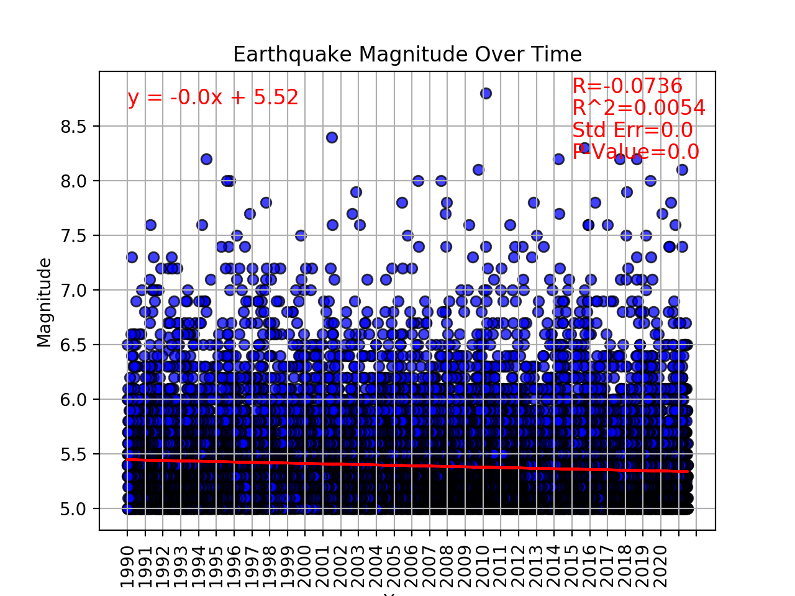
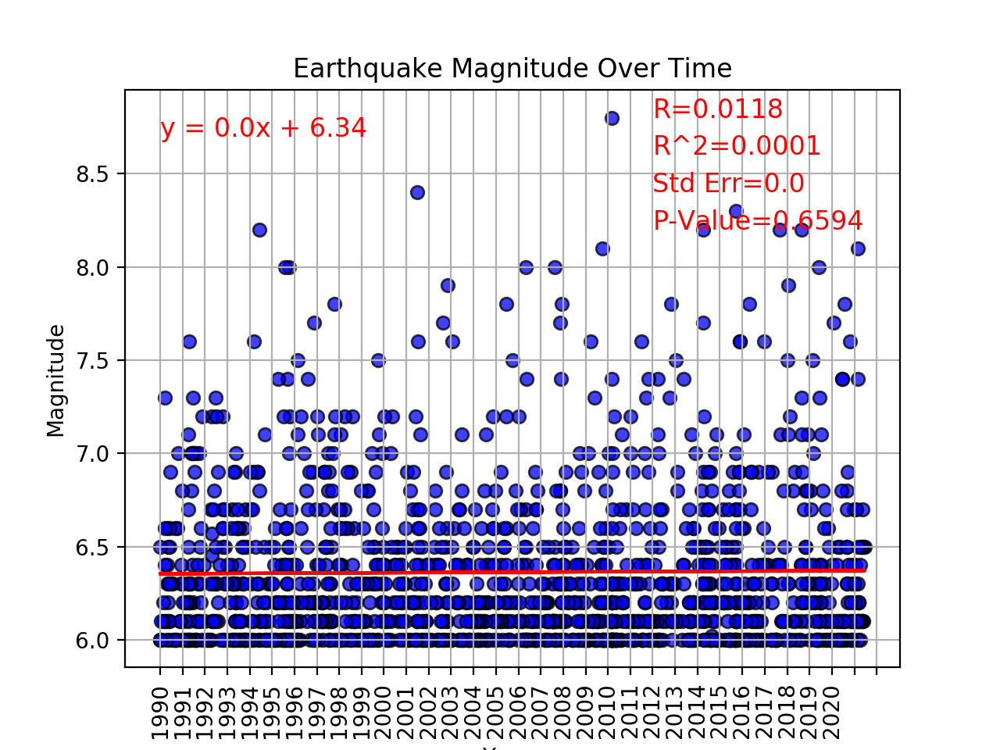
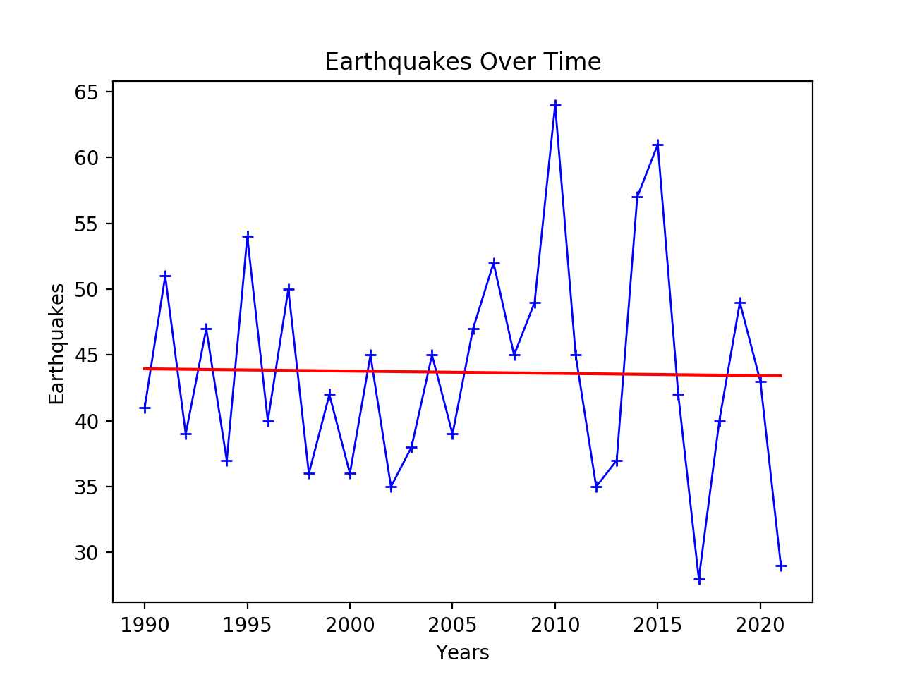
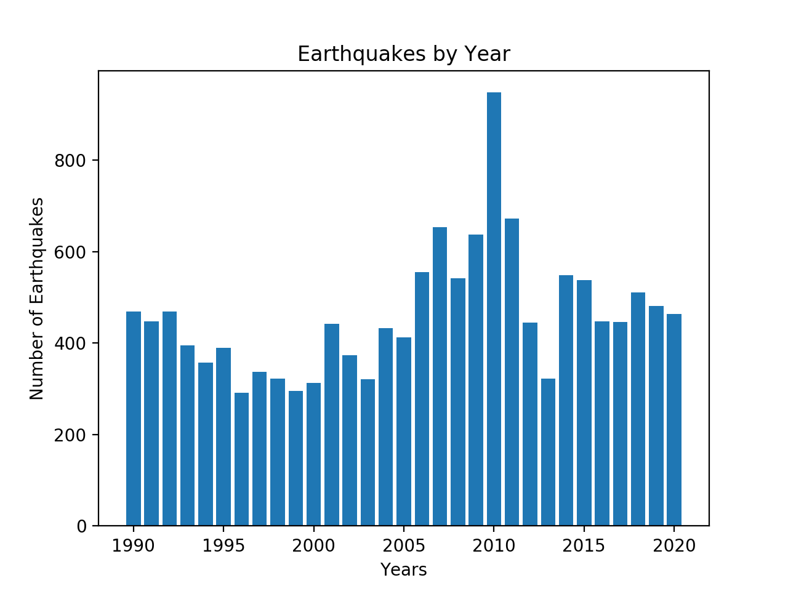
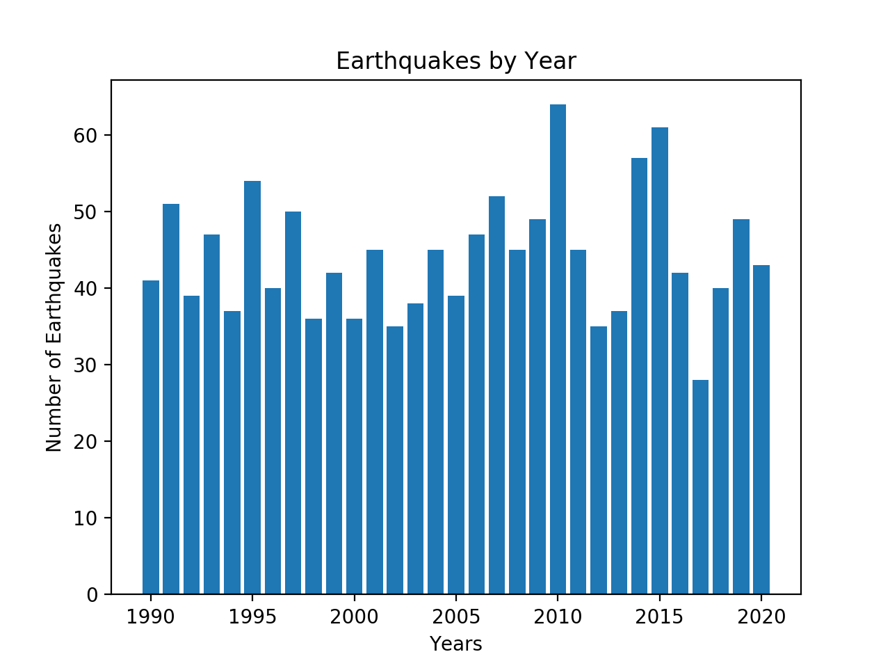
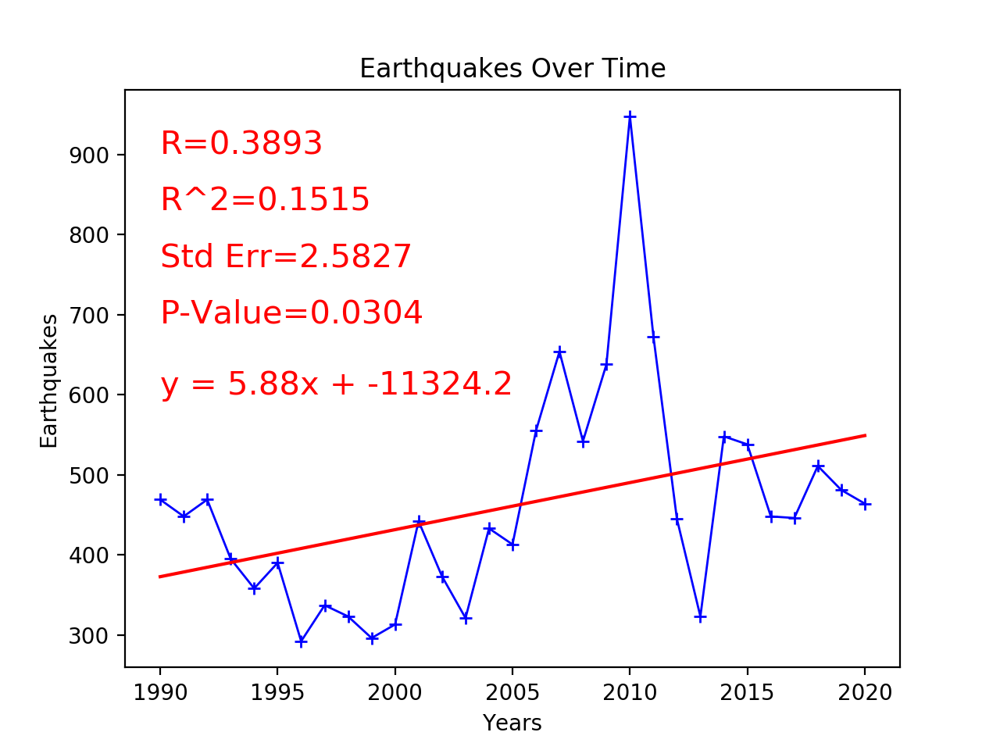
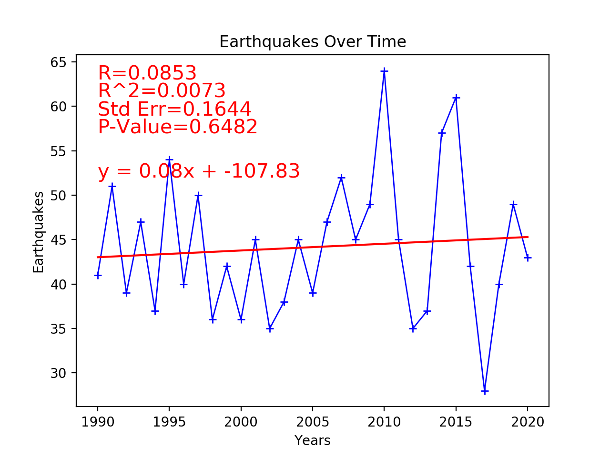
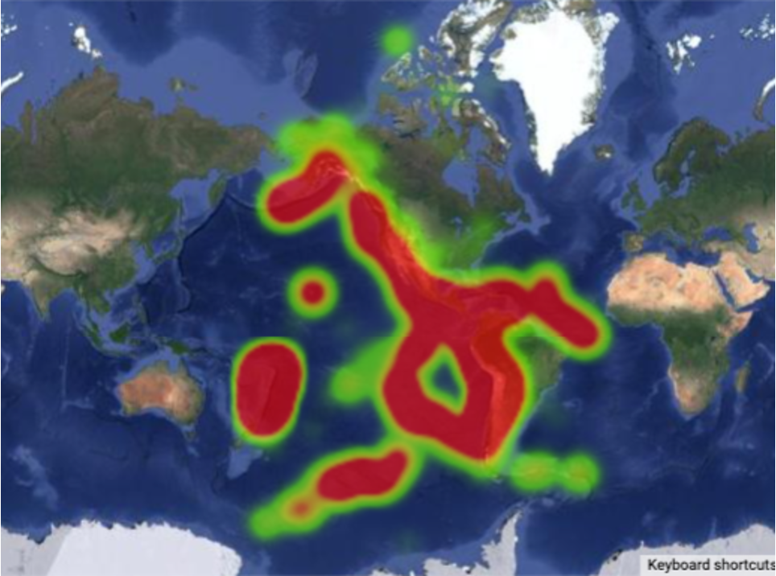

# project-1-earthquake-analysis

## Project Description

### Restrictions

1. Magnitudes of 5 or greater - this is where structural damage begins to occur and they are commonly felt by people
2. 1990 - 2021 - only the last 30 years were tracked due to the vast number of earthquakes that occur each year
3. Region - we limited the regions of analysis to North America, South America, and the South Pacific to keep it relevant to American Corporations

### Questions

1. Have Earthquakes increased in Magnitude since 1990?

2. Are Earthquakes occurring more frequently since 1990?

3. Where are Earthquakes most likely to occur?

### Regions Analyzed

North America
    Latitudes -> 15 to 80
    Longitudes -> -45 to -170

South America
    Latitudes -> -55 to -15
    Longitudes -> -25 to -75
    
South Pacific
        Latitudes -> -70 to 10
        Longitudes -> -75 to -180
        
### Earthquake Background

Magnitude     Description     Effects                                         Occurrences 1990-2021
5-5.9              Moderate       Slight Damage Chance                  13,299
6-6.9              Strong            Moderate Damage Chance               1271
7-7.9              Major              Great Damage Chance                       115
8+                  Great              Major Damage or Destruction               14

## Procedures

### API

We utilized the Earthquake Catalogs API to retrive the Magnitude, Latitude, Longitude, and Timestamp data for the given parameters (starttime, endtime, minimum magnitude, latitude range, and longitude range)

https://earthquake.usgs.gov/fdsnws/event/1/?ref=springboard

### Pandas

After this data was retrieved we utlized Pandas Data Frames to clean , group by year, bin by severity, count, and average the data

### Plotting

Using Matplotlib and Pandas we were able to create several plots, graphs, and series to analyze the data

### Google Maps

We utilized Google Maps API to create a Heat Map that helped to show where Earthquakes are most likely to occur

## Analysis

Plots are avaiable in the Slide Deck and images folder

### Average Earthquake Magnitude from 1990-2021

Average Earthquake Magnitude appears to decrease from 1990 to 2021 but after further investigation this is due to the increased number of 5-6 Magnitude Earthquakes and that is shown in the Magnitude 6 and greater plots

### Earthquakes Per Year from 1990-2020

The number of Earthquakes per Yerar has increased from 1990 to 2020 and that is mainky due to the increase in 5-6 Magnitude Earthquakes

### Earthquake Locations

As expected, Earthquakes are most likely to take place along Fault Lines and Tectonic Plate edges. In our research these primarily occurred along the Pacific, Carribean, Nazca, and Cocos Plates

## Data Visualizations

### Earthquake Magnitude over Time

#### 5.0 or Greater - Scatter

#### 6.0 or Greater - Scatter

#### 5.0 or Greater - Line

#### 6.0 or Greater - Line

### Earthquakes by Year

#### 5.0 or Greater - Bar

#### 6.0 or Greater - Bar

#### 5.0 or Greater - Line

#### 6.0 or Greater - Line

### Earthquake Activity

#### Heat Map 1990-2021
